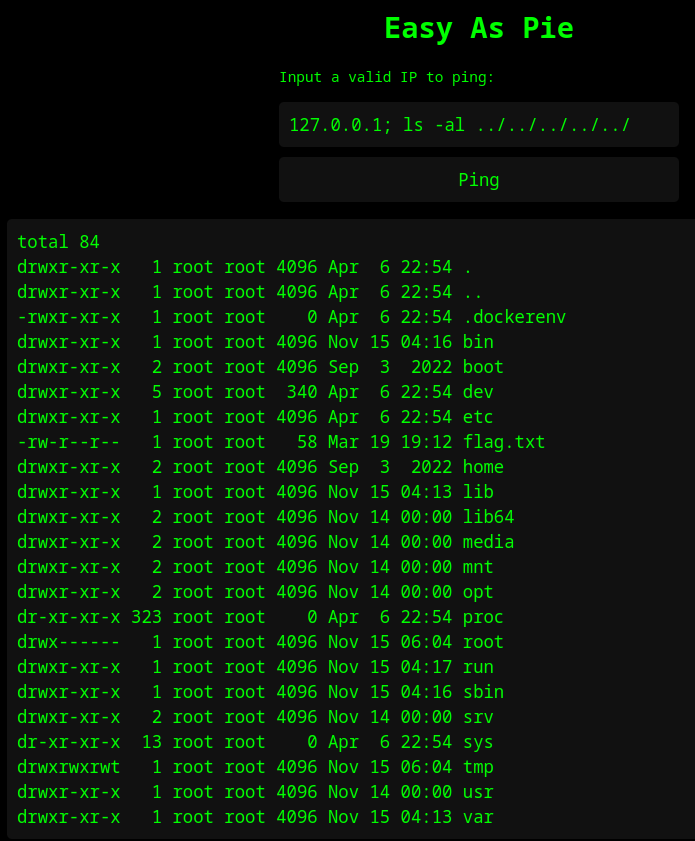
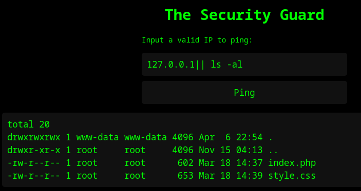

# The IP -Misc

`The script fetches a secret value. It only accepts connections from 127.0.0.1. GET parameter is ip. `

    Challenge:
        Bypass the limitation of only using numbers 0-9 to be able to submit `127.0.0.1`

Your operating system supports representing IP addresses in decimal, hex and octal formats, outside of the typical dotted decimal

Payload:

    2130706433

RSXC{IP_ADDRESSES_CAN_HAVE_MULTIPLE_FORMATS}

# The Image - Stego

`We found this image on a website, and there seems to be something redacted. Could you help us figure out what they tried to hide?`

Cyberchef:


By looking at the file, we can determine there's 2 images base64 encoded, by copying the base64 to a file and then running `cat <filename> | base64 -d > final.png` we'll get our final flag.


# The PDF - Stego

pdftohtml

The PDF contains overlayed images, to seperate them and view them individually we can use the tool `pdftohtml`


# The Course - OSINT

```Last autumn (2022) one of our employees attended a course. Can you figure out who, and where?

The format of the flag (all lower case) is: <firstname>:<geohash> The geohash will be 7 characters long.

Example of flag format: mary:uqnx9ef
```

Time to use some basic google dorking:
from the description of the challenge we know the approximate time to narrow down potential answers if there pop up several.

site:linkedin.com/company/river-security intext:"course"

`site:` to only show up results from the link specified
`intext:` a post should contain the a specified word(-s)


We now have potentially narrowed down the course name and location
Exploring the link provided doesn't really do much becuase it only redirects us to the River Security general page, but we're interested in the post itself for more information. 

We do have a snippet of the post so let's edit our soarch query abit.

`intext:"The past week was a week filled with excitement, knowledge and new friendships. I attended the SANS Institute SEC560 course in Munich taught by the inspiring"`

Since it's such a specific quote we don't really need to provide the site this time.


Now we know the name of the individual we're interested in, however we still need to find out the geohash of where this course was held.


by converting the GPS coordinates of Munich Marriott Hotel to geohash, concatinating the person's name with the geohash shortened to 7 characters we solve the challenge.

# Hacker House 

* 1-Easy As Pie
* 2-The Security guard
* 3-No Space Left
* 4-The Boss is Watching
* 5-Raising the Bar
* 6-Blind Ambition


    `Once in a remote Norwegian town, a group of skilled security professionals had convened in a fancy cabin to collaborate and achieve their objectives. On their network, they found a number of challenges that required their collective expertise. Do you have what it takes to tackle these challenges too?`

---------- Easy As Pie ------------

From the description we can safely assume it's using a ping command, however if the sanitization is done poorly we can inject another command by chaining them.

we can test if this is the case by trying to echo out a simple "hi"


we're also able to directory traverse, so let's go look around.



flag.txt - this should it be!


----------The Security guard---------


This time there's some sort of filter in place, we can assume it's `;` by just typing in `127.0.0.1;` we can confirm this. Fortunately for us `;` isn't the only way to chain commands together. `&` or `||` works just as fine.




----------No Space Left----------

This got me excited, since by the name alone I already had an idea what it could be, *flashback to a John Hammond video*. `space` is probably blacklisted, we check and sure enough that's the case, however now `;` `&` `||` are also blacklisted. Now what? `newline \n` is another interesting way we can try to accomplish our task. however we can't just use \n in it's raw form, so we have to use the URL encoded variant which is `%0A`.

Sidenote: As I completed the challenge a few days before doing the writeup an issue arrose, where including `%0A` within the syntax got double encoded into `%250A` which broke it for some reason, atleast on my end. So I couldn't get any more responses on the browser, however fixing the issue with Burp's repeater worked just fine.

proof of the issue :

`%250A`


versus `%0A`


That aside, we can craft a syntax that'll use the `\n` aswell as `${IFS}` which is an internal field seperator. Essentially `IFS=$'\n'`.

The following syntax should give us the flag: `127.0.0.1%0Acat${IFS}../../../../flag.txt`


Note: After the fact I realized that perhaps this challenge was expecting `{form}` bypass `{cat,../../../../flag.txt}` since the next one blacklisted `{}` but seems like that wasn't the case, it's still good to keep this method in mind.

----------The Boss is Watching----------

For this we're running into an issue where commands are being recognised and blocked.


To counteract this issue we can use a backslash to split up the command so `cat` becomes `c\at` for example. Note that we could also do the same thing other symbols aswell 

`127.0.0.1%0Ac\at${IFS}../../../../flag.txt`


----------Raising the Bar----------

We're now faced with an issue where `{}` seems to be blacklisted, this is no issue because we can just ignore them and use `$IFS` straight up.

`127.0.0.1%0Ac\at$IFS../../../../flag.txt`


----------Blind Ambition----------

We're faced with a boolean type blind injection. We no longer get any direct response as we did before. All we see now is `Host is up, the results will be sent via e-mail.` or `Host is down, the results will be sent via e-mail.`

The notable difference being the host is up or down and that depends on whether our syntax is valid or not. If we test with the previous challenges syntax `127.0.0.1%0Ac\at$IFS../../../../flag.txt` 


We can safely assume that our syntax is correct and is executing however the output is being sent to "e-mail" which there's no apparent way to access since every command will spit out the same response. How ever we can try writing that output to a file within the web root directory which we should be then able to access through the browser.

`127.0.0.1%0Ac\at$IFS../../../../flag.txt>Mythicalmoon.txt`


Based on the flag name it seems this wasn't quite the intended solution but we'll take it non the less.