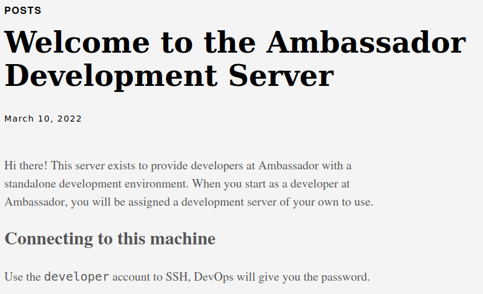
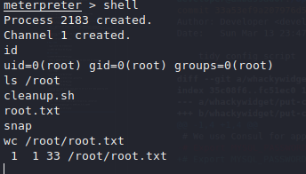

# Ambassador

# Nmap

### We have abit to explore right off the bat:
  * 22 - SSH
  * 80 - HTTP
  * 3000 - Another HTTP
  * 3306 - MySQL

# Noteworthy information
> Potentially "developer" is a user
>> Noted, but not very useful as we don't know the password.

# Gobuster

> After going through the directories, nothing of interest was found. We did download the sole image located in /images in case stegonography reveals something.

# Port 3000 - Grafana

> Innitial thought was to capture request and see if we can inject anything, Didn't seem like anything was going through after a light test, after running through sqlmap extensive attempt nothing was injectable as well.

> WE do have Grafana's version number, let's check that

> We run the script, and confirm we can read files.

> I'm not too familiar with Grafana so I researched it's documentation to find this:

> grafana.ini contains a password that will help us pivot

> With these credentials we can login grafana

> database name and user

> https://github.com/jas502n/Grafana-CVE-2021-43798

> if it's binary we can just curl it and output it and then preview with sqllite database browser

    curl --path-as-is http://10.10.11.183:3000/public/plugins/alertlist/../../../../../../../../var/lib/grafana/grafana.db -o grafana.db

> Exploring the database the table "data_source" contains the password for grafana user

# Port 3306

> Login with the Credentials

## SSH creds

> After a base64 decode we can login through SSH as developer

# Developer && PrivEsc

> User Flag:

> Directory of interest from .gitconfig

> This on it's own didn't mean much to me so I did some googling and consulted searchsploit yet again

## msfconsole - consul

    For this we will need to port forward our connection

    ssh developer@$target -L 8500:127.0.0.1:8500

