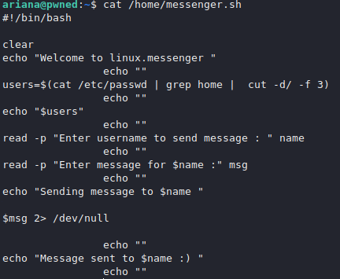

# Recon

## nmap

- 21 ftp
- 22 ssh
- 80 webserver (Apache)

## gobuster

## main

## cute comment on main page

## /nothing

> highlight everything just in case, but nothing

## robots.txt

> New directory

## hidden_text

- secret.dict

## gobuster with this dict

## /pwned.vuln

- source

## creds for FTP

    ftpuser:B0ss_Pr!ncesS

# ftp

## files - ftp

> We get both files from the FTP server for further examination

> id_rsa for ariana presumably, so we change it for ssh use

    chmod 600 id_rsa

## note.txt

> That points towards the user "ariana"

# SSH

> Note indicates ariana and an id_rsa, so it's safe to assume we can try and SSH in with ariana

# User ariana:

## flag

## SUDO Enum

## all users: + messenger

## messenger.sh

> We can execute messeneger as selena

> From the code we can tell that we could execute code as selena, so if we run `bash -i` to run a bash interface, we should be golden.
>> The code doesn't actually send anything to any user, however it does execute the msg as a command and redirects errors into `/dev/null`

> to run a sudo command as another user we need to add the -u flag and the user.

    sudo -u selena /home/messenger.sh

> run a few basic enumerations to find something further, but I found nothing, so I had to examine groups assigned to selena. only one that's actually worth checking out is "docker"

## gtfobins

> we check docker's gtfobins and see a way to get a root shell.

    docker run -v /:/mnt --rm -it alpine chroot /mnt sh

> flag proof for root.

