# Nmap

> Ussual generic scan to enumerate versions and scripts

> Ports 22,80,8082 

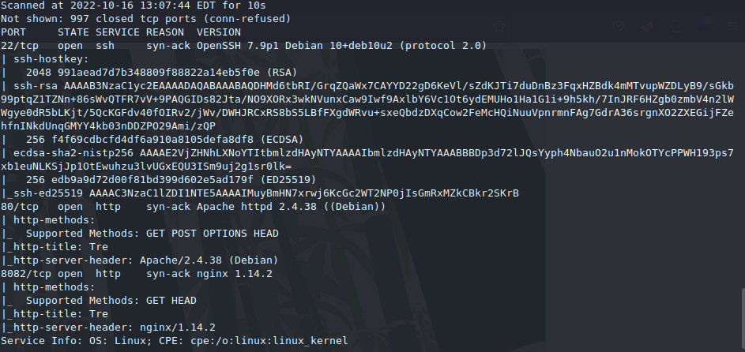

# gobuster

    gobuster dir -u http://tre.pg -w /usr/share/wordlists/seclists/Discovery/Web-Content/big.txt  -o gobuster/tre-ext.out -x php                     

    gobuster dir -u http://tre.pg/cms -w /usr/share/wordlists/seclists/Discovery/Web-Content/big.txt  -o gobuster/cms.out -x php,txt  

    gobuster dir -u http://tre.pg/mantisbt -w /usr/share/wordlists/seclists/Discovery/Web-Content/big.txt  -o gobuster/mantisbt.out -x php,txt   

> I try to limit my wordlists and extensions since my system is quite weak and it'd take too long. Only if nothing gets found I'd run a larger scan.
Also: webserver on 8082 didn't return anything besides index for a while, so we kind of dropped it.

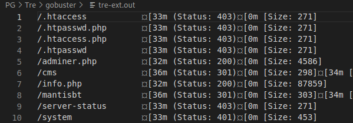

> went one depth deeper on the initial finds

* cms

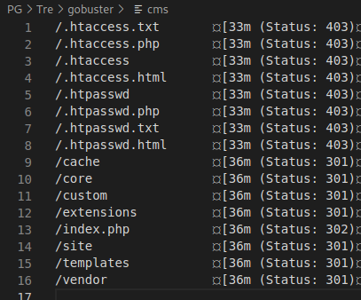

* mantisbt

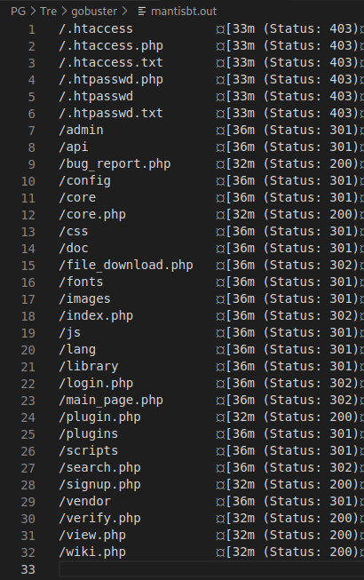


## main page

> Nothing interesting in source either.

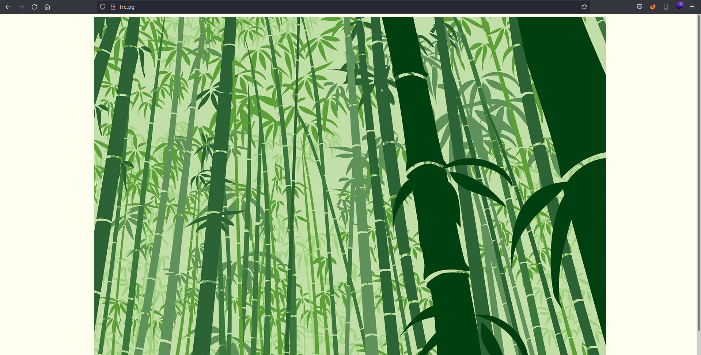

# /system 

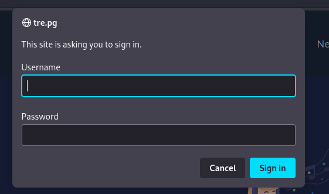

> Just a few common credentials later -> we got through with admin:admin 

## mantis 

> Common credentials weren't applicable here, so I intercepted the request and checked it out with BurpSuite, however nothing really stood out, and it seemed too early to attempt a brute force. So we'll return back to it if nothing else works.

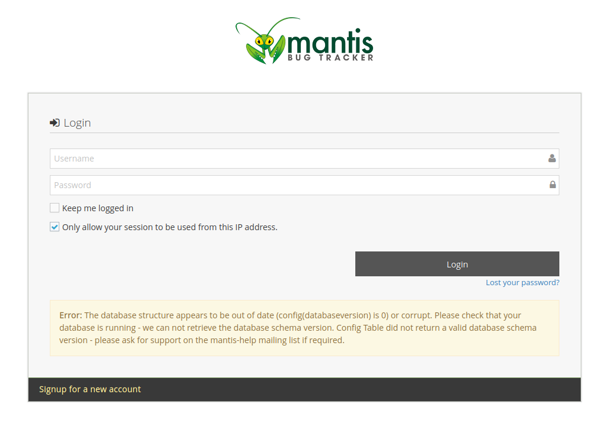

## info.php

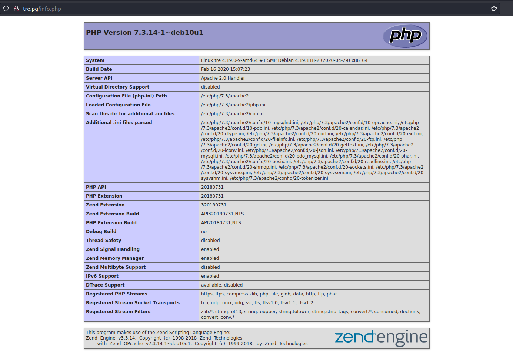

## config within a.txt

> After exploring gobuster's directories we came across configs

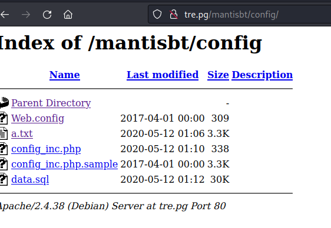

## database config

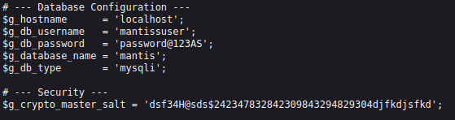

```
# --- Database Configuration ---
$g_hostname      = 'localhost';
$g_db_username   = 'mantissuser';
$g_db_password   = 'password@123AS';
$g_database_name = 'mantis';
$g_db_type       = 'mysqli';

# --- Security ---
$g_crypto_master_salt = 'dsf34H@sds$242347832842309843294829304djfkdjsfkd';	
```
# Adminer.php

> So we try and login with the credentials we acquired.

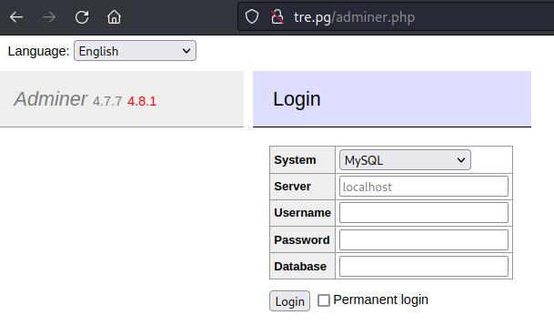

## logged in as mantissuser

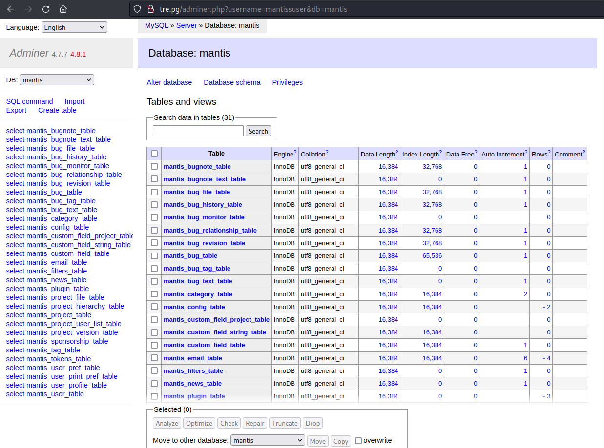

## mantis_user_table

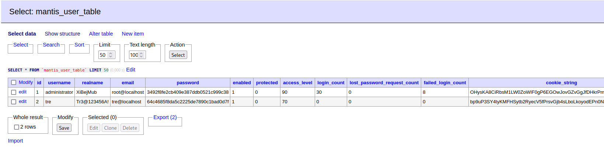

> We did explore the logins for Mantis aswell as SSH and Tre got us through SSH with Credentials: "tre:Tr3@123456A!"

# ssh login as user:Tre

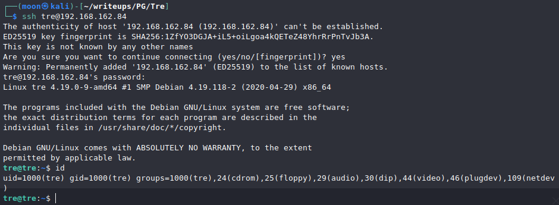

## user flag

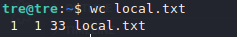

## Checking SUDO

    sudo -l

> GTFOBins doesn't really help with shutdown here, however, we can shutdown, halt or restard the machine, on it's own not useful though.

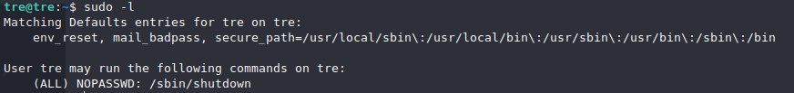

## man for shutdown

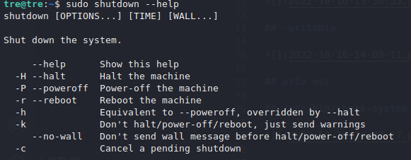


## -writable

    find / -writable 2>/dev/null

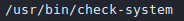

> Or alternatively host a simple python server wget LinPeas and run it on system for a more in-depth scan.

# Privilege  escalation

> We discover that we can read and write to /usr/bin/check-system, however can't execute it, however since we can restard the system, we can pair it up with our SUDO privileges and we should be able to gain root shell since the file is owned by root.

## /usr/bin/check-system

> Initially tried a NC revershell, but forgot to check if netcat is on the machine, turns out it isn't, so we just use a bash -i shell. 

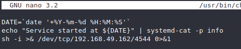

    sudo shutdown -r now

> Set up a listener on local system and wait.

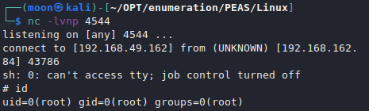

## root and flag

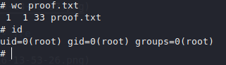


