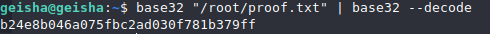

## nmap :

    nmap -sC -sV -vv 192.168.154.82

## gobuster port 80: - Nothing

## gobuster port 8088:

    gobuster dir -u http://192.168.154.82 -w /usr/share/wordlists/seclist/discovery/web-content/2.3-med.txt

## 8088:/docs - exposed old litespeed

## port 21:
tried login with anonymous - No luck

## searchsploit for litespeed 1.7: - no non-authentic exploits

## SSH port 22 Attack:
Before trying random usernames and password, lets assume the username is the theme of the website : geisha

    hydra -l geisha -P /usr/share/wordlists/rockyou.txt 192.168.154.82 ssh

## we're in: flag-proof:

    find / -perm /4000 2>/dev/null

## SUID priv esc of base32:

## /etc/shaodow

## cheating for flag:

## discovery of root's id_rsa:

## id_rsa 

## flag:

