# Insanity - Hard

    export target="192.168.81.124"

# nmap 

    nmap -sC -sV -vv -oA nmap/base $target

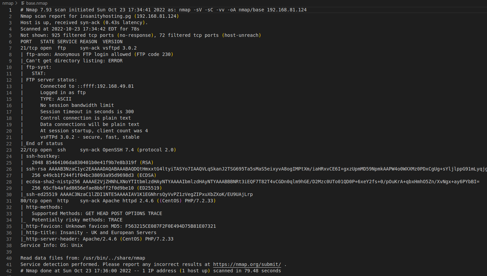

# gobuster

    gobuster dir -u http://$target -w /usr/share/wordlists/seclists/Discovery/Web-Content/big.txt -o gobuster/base-ext.out -x php,txt,html

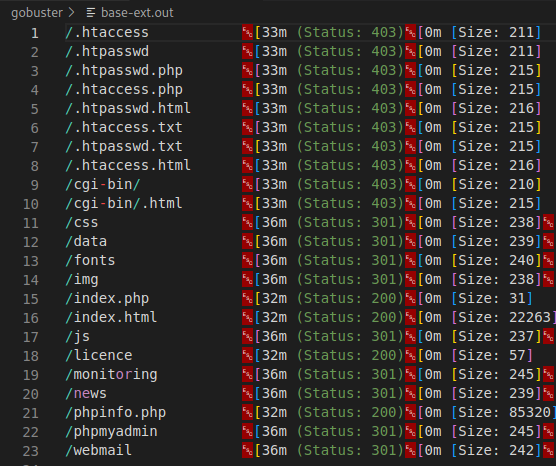

> /monitoring seemed interesting so I went enumerated another level deeper just in case

    gobuster dir -u http://$target/monitoring -w /usr/share/wordlists/seclists/Discovery/Web-Content/big.txt -o gobuster/monitoring-ext.out -x php,txt,html

# ftp

> While gobuster was going, we looked into FTP
> 
> - log in as anonymous:anonymous
>
> Nothing of values really.

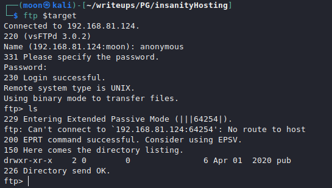

# WEB

## /myphpadmin

> Several default credential login attempts failed, however if you try logging in with username only, any username you'll get in. However there's no useful information on there.

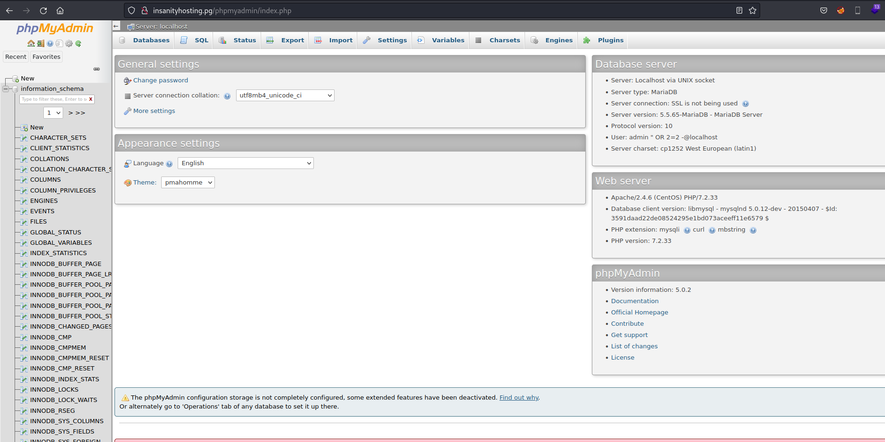

## /news 

> We discover a potential username "Otis"

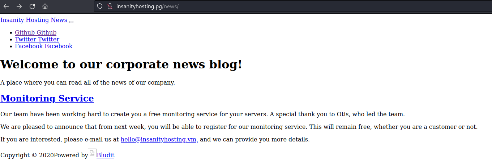

## /webmail

> Squirrelmail version 1.4.22 is exploitable by RCE however we dont have any credentials.

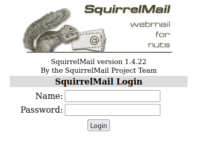

## /monitoring

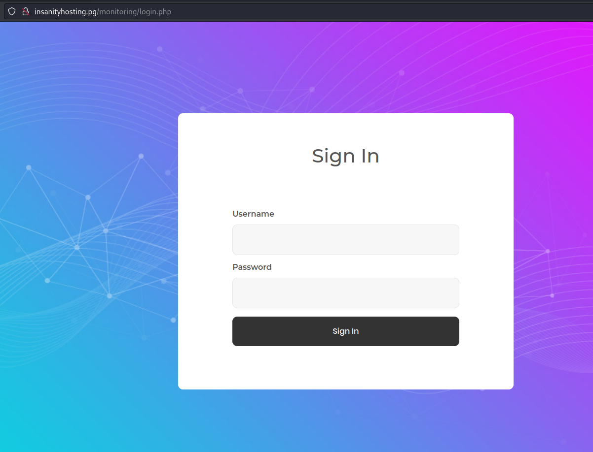

> At this point we've looked around and found nothing else of value really, so time to look into a brute forcing option

## BruteForce

    hydra -l otis -P /usr/share/wordlists/rockyou.txt insanityhosting.pg http-post-form '/monitoring/login.php:username=^USER^&password=^PASS^&Login=Login:Sign In' -t 64

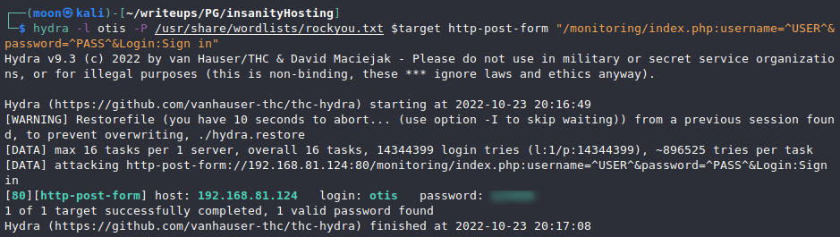

> After obtaining the credentials, we can login /webmail and /monitoring.
>
> We can see that we can ping, we saw ping.php earlier:

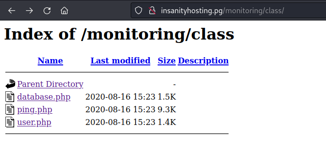

> So I assumed we could try a command injection, however no matter what I tried, we got nowhere. Since errors were mailed to /webmails and we saw database.php it was safe to assume there was some sort of db involved. so little by little we tried injecting SLQ syntaxes. It was quite a hassle but we eventually got to a point where we could exfiltrate data by using UNION based technique.

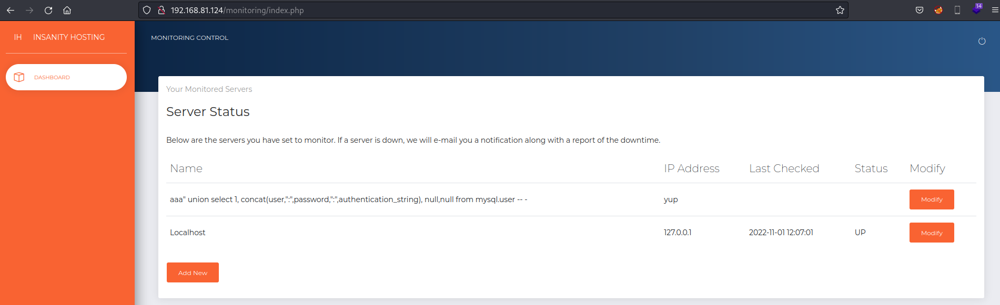

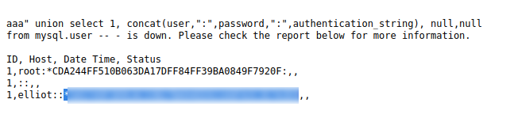

> After cracking these, we can SSH in with the newly discovered user.

# SSH and PrivEsc
    
> After obtaining the flag, I immediately noticed that we have an unussual mozilla directory, I assumed we could extract some credentials, if any of them are saved there. But I shelved that idea and looked for something I was more familiar with, unfortunately after manual and automated enumeration nothing was immediately obvious that we could leverage. So I returned back to our mozilla files, after some research we got a tool to decrypt credentials from mozilla files if there are any.

> First however we need to transfer the files to our machine, purely for conveniency. We could also just download the decryptor to the target machine, there's no difference.

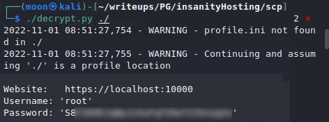

> First I thought the password wasn't plaintext, but after several cracking attempt failures, I just tried it as plain and to my surprise it worked.

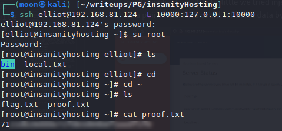

