# Valley

## Enumeration
### ssh

```bash
PORT      STATE SERVICE REASON  VERSION
22/tcp    open  ssh     syn-ack OpenSSH 8.2p1 Ubuntu 4ubuntu0.5 (Ubuntu Linux; protocol 2.0)
| ssh-hostkey: 
|   3072 c2:84:2a:c1:22:5a:10:f1:66:16:dd:a0:f6:04:62:95 (RSA)
| ssh-rsa AAAAB3NzaC1yc2EAAAADAQABAAABgQCf7Zvn7fOyAWUwEI2aH/k8AyPehxzzuNC1v4AAlhDa4Off4085gRIH/EXpjOoZSBvo8magsCH32JaKMMc59FSK4canP2I0VrXwkEX0F8PjA1TV4qgqXJI0zNVwFrfBORDdlCPNYiqRNFp1vaxTqLOFuHt5r34134yRwczxTsD4Uf9Z6c7Yzr0GV6NL3baGHDeSZ/msTiFKFzLTTKbFkbU4SQYc7jIWjl0ylQ6qtWivBiavEWTwkHHKWGg9WEdFpU2zjeYTrDNnaEfouD67dXznI+FiiTiFf4KC9/1C+msppC0o77nxTGI0352wtBV9KjTU/Aja+zSTMDxoGVvo/BabczvRCTwhXxzVpWNe3YTGeoNESyUGLKA6kUBfFNICrJD2JR7pXYKuZVwpJUUCpy5n6MetnonUo0SoMg/fzqMWw2nCZOpKzVo9OdD8R/ZTnX/iQKGNNvgD7RkbxxFK5OA9TlvfvuRUQQaQP7+UctsaqG2F9gUfWorSdizFwfdKvRU=
|   256 42:9e:2f:f6:3e:5a:db:51:99:62:71:c4:8c:22:3e:bb (ECDSA)
| ecdsa-sha2-nistp256 AAAAE2VjZHNhLXNoYTItbmlzdHAyNTYAAAAIbmlzdHAyNTYAAABBBNIiJc4hdfcu/HtdZN1fyz/hU1SgSas1Lk/ncNc9UkfSDG2SQziJ/5SEj1AQhK0T4NdVeaMSDEunQnrmD1tJ9hg=
|   256 2e:a0:a5:6c:d9:83:e0:01:6c:b9:8a:60:9b:63:86:72 (ED25519)
|_ssh-ed25519 AAAAC3NzaC1lZDI1NTE5AAAAIEZhkboYdSkdR3n1G4sQtN4uO3hy89JxYkizKi6Sd/Ky
80/tcp    open  http    syn-ack Apache httpd 2.4.41 ((Ubuntu))
| http-methods: 
|_  Supported Methods: GET POST OPTIONS HEAD
|_http-title: Site doesn't have a title (text/html).
|_http-server-header: Apache/2.4.41 (Ubuntu)
37370/tcp open  ftp     syn-ack vsftpd 3.0.3
Service Info: OSs: Linux, Unix; CPE: cpe:/o:linux:linux_kernel
```
### Webpage

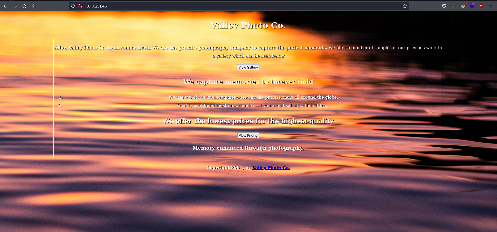

Mapping the website we come across 3 directories without even attempting directory enumeration. 

- gallery
- pricing
- static

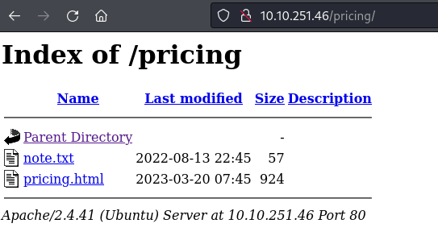

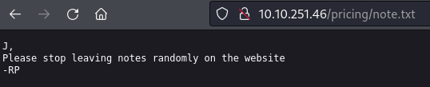

`Gallery` and `pricing` both had proper indexing, however static didn't show anything even though we know there's atleast 18 images.

### DirEnum

```bash
export target="10.10.251.46"
ffuf -w=/path/to/wordlist -u http://$target/static/FUZZ -c -of csv -o dirbust/static -fc 403 
```

By fuzzing `/static/` endpoint we found a `00` result, initially when i saw the pictures names as numerical values in sequence, I instinctively tried `0` but that resulted in nothing, then i created a wordlist of numbers from 0-40000 to cover a wide range, you can do so with `seq 0 40000 > name.txt`. However as it didn't contain `00` it returned nothing new when fuzzing. So it's wise to use common wordlists before trying a custom one, or try appending them and creating a custom one depending on the target.

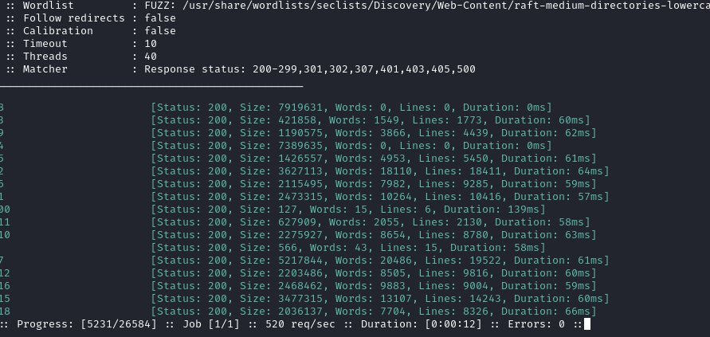

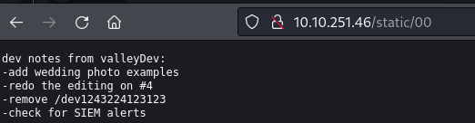

## Foothold
### Web login
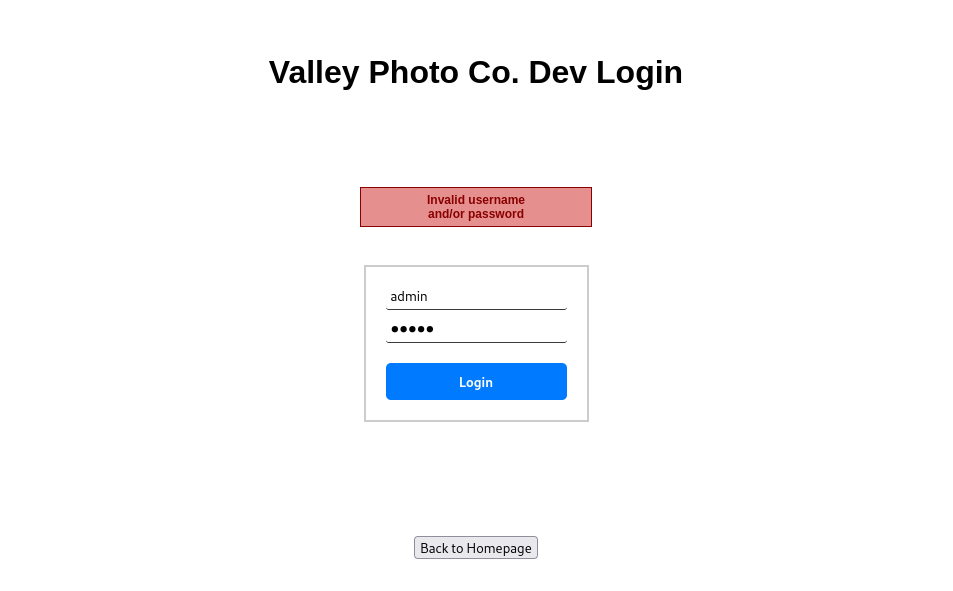

/dev1243224123123/ has an incredibly fast error response, might be client-side validation, which would imply hard coded credentials


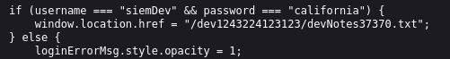

siemDev:california

> devNotes37370.txt

```
dev notes for ftp server:
-stop reusing credentials
-check for any vulnerabilies
-stay up to date on patching
-change ftp port to normal port
```

### FTP

```bash
ftp 10.10.251.46 -p 37370
```

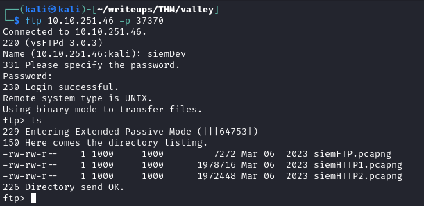

we'll `get` all of the files, in this case the names are straight forward and the files aren't that many so we can download them one by one, however if there was a truck load we could mass download them with:

```bash
wget ftp://10.10.251.46:37370/* --ftp-user=siemDev --ftp-pass=california
```

I painfully looked through everything, however of you want to *cheese* pcap's sometimes you can strings them and pipe into grep to look for specific strings like, `uname, login, password, passwd, pswd, pwd, token, secret, cookie, SSID, etc.` However it runs the risk of missing something important.

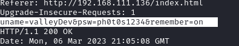

With the new credentials we can try ssh.

## PrivEsc

### ValleyDev - user

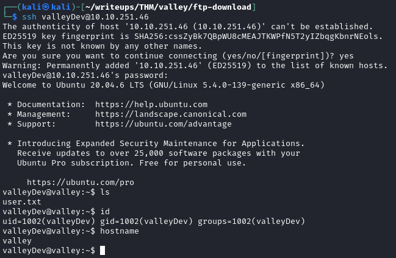

Weird place for an elf file to be at. `/home` 

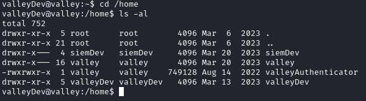

As `valleyAuthenticator` is a chunky boy and we'll want to dig into it deeper I'd rather have it on my system to inspect. So we'll secure copy it onto our system.

```bash
scp valleyDev@10.10.251.46:/home/valleyAuthenticator .
```

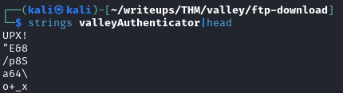

As it's massive it's a good idea to pipe it into less or head to maybe narrow down some options. In this case we see a clue that it's packaged with UPX!

```bash
upx -d alleyAuthenticator
strings valleyAuthenticator -n 8 | grep -Ev "^\_" 
```

It's still a lot to look through, so I ended up throwing it into ghidra, However the string is still in there I just initally missed it.

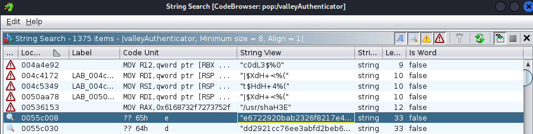

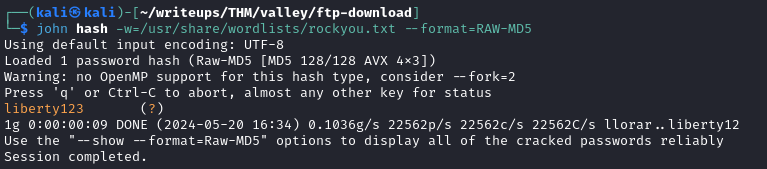

### Valley - user

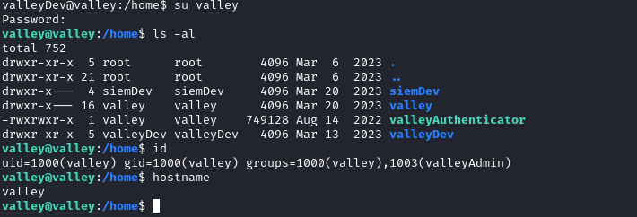

When there's an extra group it's a good idea to look what it's uniq privileges are for the user.

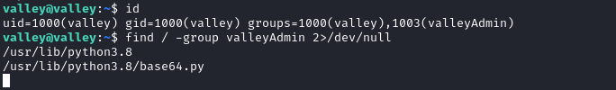

We could use this library to privEsc by editing it, if it's being used by anything.

And just our luck, there's a cronjob running using base64


```python3
#!/usr/bin/python3
import base64
for i in range(1,7):
# specify the path to the image file you want to encode
        image_path = "/photos/p" + str(i) + ".jpg"

# open the image file and read its contents
        with open(image_path, "rb") as image_file:
          image_data = image_file.read()

# encode the image data in Base64 format
        encoded_image_data = base64.b64encode(image_data)

# specify the path to the output file
        output_path = "/photos/photoVault/p" + str(i) + ".enc"

# write the Base64-encoded image data to the output file
        with open(output_path, "wb") as output_file:
          output_file.write(encoded_image_data)
```

All we need to do to is import `os` into `base64.py` and execute the command to create a copy of bash and chmod it to have SUID bit.

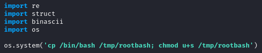

Save and wait for cronjob to do it's job. Once it's done `./rootbash -p` to gain root.
the `-p` keeps privileges.

### root

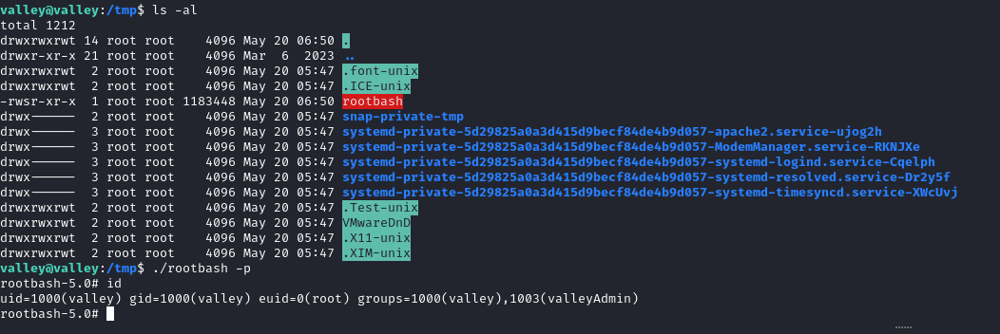

